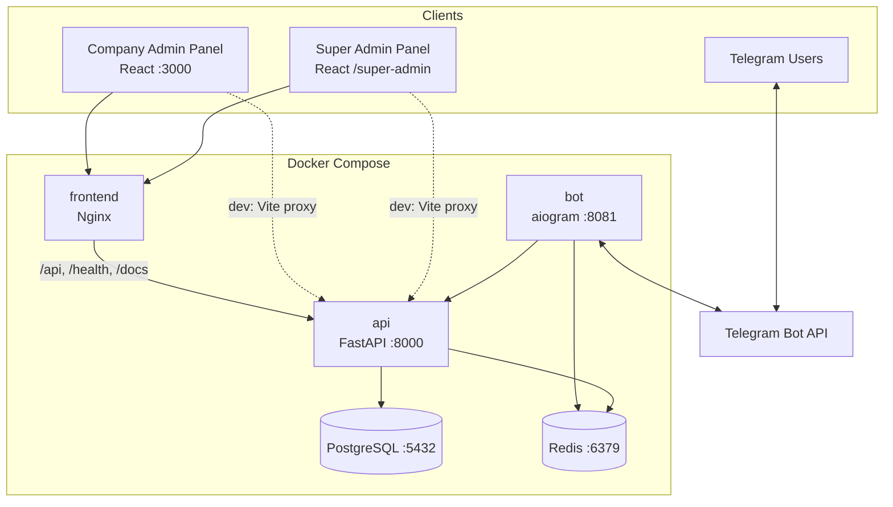
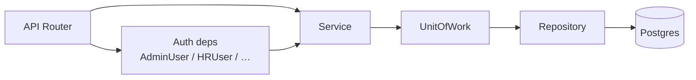
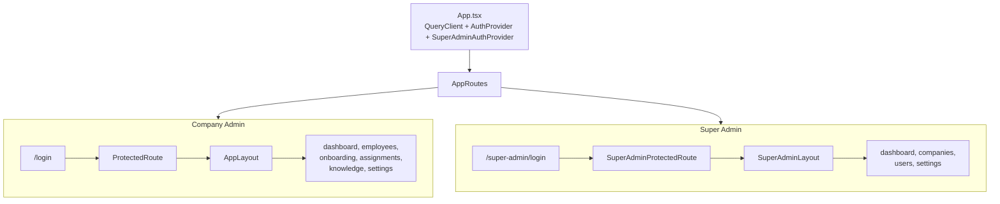
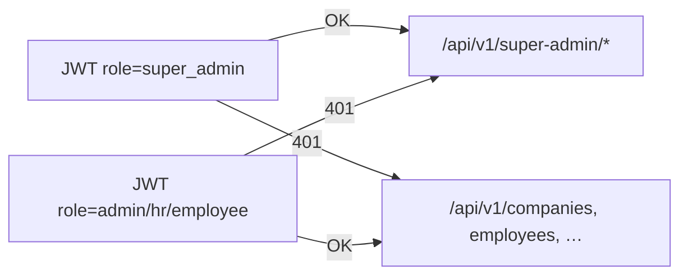
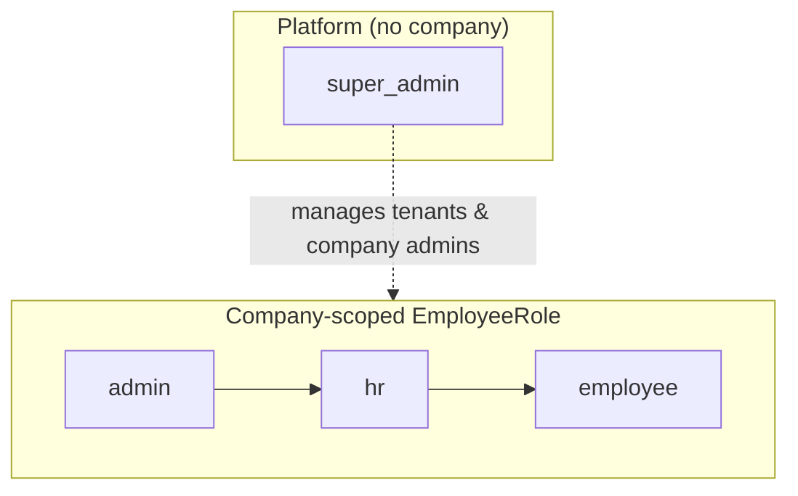
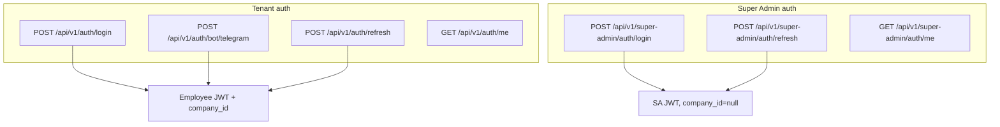
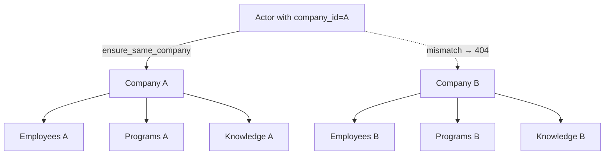
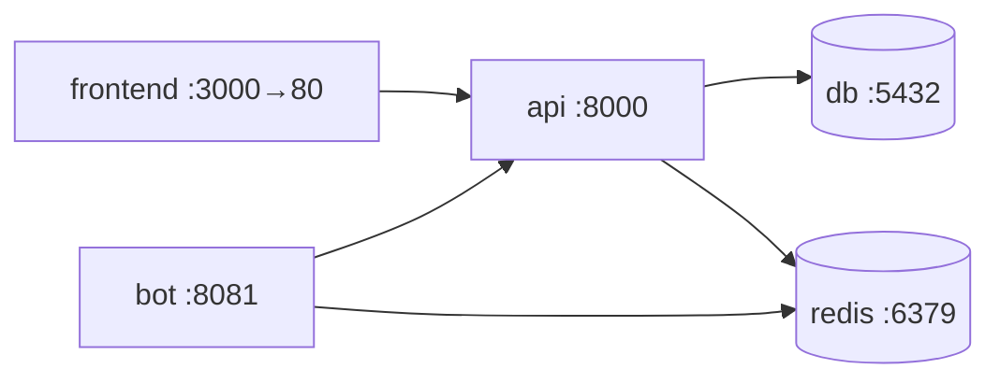
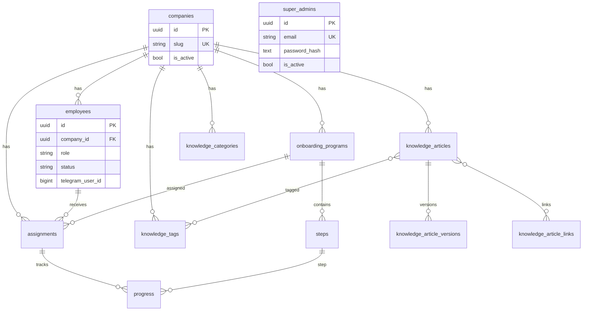
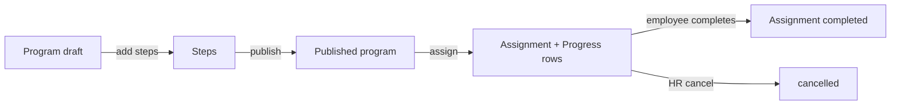

# OnboardAI — Architecture

Telegram-first multi-tenant SaaS for AI-powered employee onboarding.

This document describes the system as implemented in the repository. For runbooks, see [DEPLOYMENT.md](DEPLOYMENT.md) and [README.md](README.md).

---

## Table of contents

1. [Общая архитектура](#1-общая-архитектура)
2. [Backend](#2-backend)
3. [Frontend](#3-frontend)
4. [Telegram Bot](#4-telegram-bot)
5. [Super Admin](#5-super-admin)
6. [Company Admin](#6-company-admin)
7. [RBAC](#7-rbac)
8. [JWT](#8-jwt)
9. [Multi-tenancy](#9-multi-tenancy)
10. [Docker](#10-docker)
11. [Database](#11-database)
12. [API](#12-api)
13. [Deployment](#13-deployment)

---

## 1. Общая архитектура

### Назначение

OnboardAI позволяет компаниям:

- создавать онбординг-программы и шаги;
- назначать программы сотрудникам;
- отслеживать прогресс;
- вести базу знаний;
- давать сотрудникам проходить шаги через Telegram-бота;
- управлять тенантами на уровне платформы (Super Admin).

### Стек

| Слой | Технологии |
|------|------------|
| API | Python 3.13, FastAPI, SQLAlchemy (async), Alembic, PyJWT |
| БД | PostgreSQL 16 |
| Кэш / FSM | Redis 7 |
| Bot | aiogram 3, aiohttp (webhook) |
| Admin UI | React, Vite, TanStack Query, React Router, Tailwind |
| Оркестрация | Docker Compose, Nginx (SPA + reverse proxy) |

### Высокоуровневая схема



### Границы ответственности

| Компонент | Ответственность | Чего не делает |
|-----------|-----------------|----------------|
| **API** | Бизнес-логика, auth, RBAC, tenancy, персистентность | UI, прямой Telegram I/O |
| **Frontend** | Company Admin + Super Admin UI | Прямой доступ к БД |
| **Bot** | UX в Telegram, вызовы REST | Прямой доступ к БД |
| **Postgres** | Единственный источник истины | — |
| **Redis** | Bot FSM storage, rate-limit helpers | Primary data store |

### Структура репозитория

```
onboard-ai/
├── app/                  # Backend + Telegram bot
│   ├── api/              # FastAPI routers, deps, auth
│   ├── bot/              # aiogram handlers & API client
│   ├── core/             # config, security, exceptions
│   ├── db/               # models, enums, session, UoW
│   ├── repositories/     # data access
│   ├── schemas/          # Pydantic DTOs
│   ├── services/         # business logic
│   └── main.py
├── frontend/             # React admin panels
├── alembic/              # migrations
├── docker/               # entrypoint scripts
├── scripts/              # seed_demo, seed_super_admin
├── tests/
├── docker-compose.yml
├── Dockerfile
├── .env.example
├── README.md
└── DEPLOYMENT.md
```

---

## 2. Backend

### Слоистая архитектура



| Слой | Путь | Роль |
|------|------|------|
| API | `app/api/v1/` | HTTP, валидация входа, role guards |
| Schemas | `app/schemas/` | Pydantic request/response |
| Services | `app/services/` | Use-cases, tenancy checks, оркестрация |
| Repositories | `app/repositories/` | CRUD, без `commit` |
| Unit of Work | `app/db/uow.py` | Одна `AsyncSession`, явный `commit` |
| Models | `app/db/models/` | SQLAlchemy ORM |
| Core | `app/core/` | Settings, JWT, passwords, exceptions |

### Паттерн запроса

1. Router получает `Depends(AdminUser | HRUser | …)`.
2. Вызывает service с `actor_company_id=current_user.company_id` (tenant) или без company scope (Super Admin).
3. Service открывает `UnitOfWork`, пишет через repositories, делает `commit`.
4. Cross-tenant mismatch → `NotFoundError` → HTTP **404** (не 403).

### DI

`app/api/deps.py` — `@lru_cache` фабрики сервисов для FastAPI `Depends`.

### Доменные агрегаты

| Агрегат | Service | Repository |
|---------|---------|------------|
| Company | `CompanyService` | `CompanyRepository` |
| Employee | `EmployeeService` | `EmployeeRepository` |
| Program / Step | `OnboardingProgramService`, `StepService` | matching repos |
| Assignment / Progress | `AssignmentService`, `ProgressService` | matching repos |
| Knowledge | `ArticleService`, `CategoryService`, `TagService` | matching repos |
| Platform | `PlatformService`, `SuperAdminAuthService` | `SuperAdminRepository` + raw counts |

---

## 3. Frontend

Одно React-приложение (`frontend/`) обслуживает **две панели** с раздельным auth и маршрутами.



### Технологии UI

- React + Vite + TypeScript
- React Router
- TanStack Query
- Tailwind CSS
- Общие UI-примитивы: `Button`, `Field`, `Badge`, `PageHeader`

### HTTP-клиенты

| Клиент | Токены | Refresh |
|--------|--------|---------|
| `services/apiClient.ts` | `onboard_access_token` / `onboard_refresh_token` | `POST /api/v1/auth/refresh` |
| `services/superAdminApiClient.ts` | `onboard_sa_access_token` / `onboard_sa_refresh_token` | `POST /api/v1/super-admin/auth/refresh` |

Сессии **не пересекаются**: можно (теоретически) иметь оба набора токенов в `localStorage`, но панели используют разные клиенты.

### Сборка / прод

- Dev: Vite (`5173`), proxy `/api` → API
- Compose: multi-stage `frontend/Dockerfile` → Nginx (`:80`), наружу `FRONTEND_PORT` (default `3000`)
- Nginx проксирует `/api`, `/health`, `/docs` → `api:8000`

---

## 4. Telegram Bot

### Расположение

```
app/bot/
├── __main__.py          # polling | webhook entry
├── factory.py           # Bot, Dispatcher, API client
├── api/client.py        # REST client (no DB)
├── handlers/            # start, onboarding
├── keyboards/
├── middlewares/
└── states/
```

### Режимы запуска

| Условие | Режим |
|---------|--------|
| `BOT_TOKEN` пустой | Контейнер idle (`sleep infinity`) |
| `BOT_WEBHOOK_URL` пустой | Long polling |
| `BOT_WEBHOOK_URL` задан | aiohttp webhook на `BOT_WEBHOOK_PORT` (default `8081`) |

### Аутентификация бота к API

```mermaid
sequenceDiagram
  participant U as Telegram User
  participant B as Bot
  participant API as FastAPI

  U->>B: /start or Мой онбординг
  B->>API: POST /api/v1/auth/bot/telegram<br/>X-Bot-Service-Token<br/>{company_id, telegram_user_id}
  API-->>B: access_token + refresh_token + employee
  B->>API: GET/POST with Authorization Bearer
  Note over B,API: On 401 → refresh; else re-exchange
```

Ключевые факты:

- Бот **не ходит в Postgres** — только REST.
- Тенант бота зафиксирован env `BOT_COMPANY_ID`.
- Идентичность сотрудника: `(company_id, telegram_user_id)`.
- Rate-limit на bot login: `BOT_LOGIN_RATE_LIMIT` / `BOT_LOGIN_RATE_WINDOW_SECONDS`.

### Типовой user-flow

1. HR создаёт сотрудника с реальным `telegram_user_id`, публикует программу, назначает assignment.
2. Сотрудник в Telegram: `/start` → **Мой онбординг**.
3. Бот получает JWT, грузит active assignment + progress, показывает шаг.
4. Complete → `POST /api/v1/progress/{id}/complete`.
5. Company Admin Dashboard отражает прогресс.

---

## 5. Super Admin

Платформенный оператор **не принадлежит ни одной компании**.

### Идентичность

- Таблица `super_admins` (модель `SuperAdmin`)
- Поля: `id`, `email`, `full_name`, `password_hash`, `is_active`, timestamps
- Роль в JWT: `PlatformRole.SUPER_ADMIN` = `"super_admin"`
- `company_id` в токене: `null`

### Auth

- `POST /api/v1/super-admin/auth/login` — email + password (PBKDF2-SHA256)
- Bootstrap: `scripts/seed_super_admin.py` + API entrypoint
- Env: `SUPER_ADMIN_EMAIL`, `SUPER_ADMIN_PASSWORD`, `SUPER_ADMIN_FULL_NAME`

### Возможности (`PlatformService`)

| Область | Возможности |
|---------|-------------|
| Dashboard | Глобальные счётчики: companies, employees, active programs, assignments, KB articles |
| Companies | Список всех тенантов, создание (+ первый admin), edit, activate/deactivate, detail |
| Users | Список company admin/HR, смена роли, block (archive) |
| Settings | In-memory stub (не персистится) |

### UI

- Базовый путь: `/super-admin/*`
- Layout: `SuperAdminLayout` (отдельный сайдбар «Super Admin»)
- Guard: `SuperAdminProtectedRoute`

### Изоляция от tenant API



Реализация: `get_current_user` отклоняет `super_admin`; `get_current_super_admin` требует `super_admin`.

---

## 6. Company Admin

Тенантная панель для **admin** и **hr** одной компании.

### Доступ

- Frontend gate: `canAccessAdminPanel` → только `admin` | `hr`
- Сотрудник с ролью `employee` может иметь JWT (bot/API), но **не** входит в Admin Panel

### Маршруты

| Путь | Назначение |
|------|------------|
| `/login` | Employee UUID + `AUTH_PASSWORD` |
| `/dashboard` | Прогресс / assignments overview |
| `/employees/*` | CRUD сотрудников |
| `/onboarding/*` | Программы и шаги |
| `/assignments/*` | Назначения |
| `/knowledge/*` | Статьи, категории, теги |
| `/settings` | Stub |

### Login

1. `POST /api/v1/auth/login` (OAuth2 password: username = employee UUID).
2. Токены в `localStorage`.
3. `GET /api/v1/auth/me` + проверка роли.
4. Все API-вызовы scoped к `current_user.company_id`.

### Demo seed

| Роль | UUID | Password |
|------|------|----------|
| Company Admin | `22222222-2222-4222-8222-222222222222` | `AUTH_PASSWORD` |
| HR | `33333333-3333-4333-8333-333333333333` | `AUTH_PASSWORD` |
| Employee | `44444444-4444-4444-8444-444444444444` | (bot / API) |
| Company | `11111111-1111-4111-8111-111111111111` | — |

---

## 7. RBAC

### Роли



| Enum | Values | Где хранится |
|------|--------|--------------|
| `EmployeeRole` | `employee`, `hr`, `admin` | `employees.role` (+ DB check constraint) |
| `PlatformRole` | `super_admin` | JWT + таблица `super_admins` (не в `employees`) |

Company-роли **не переписывались** при добавлении Super Admin.

### FastAPI dependency aliases

| Alias | Allowed roles | Типичное использование |
|-------|---------------|------------------------|
| `AdminUser` | `admin` | Companies (tenant) |
| `HRUser` | `admin`, `hr` | Employees, programs, assignments, knowledge write |
| `EmployeeUser` | `admin`, `hr`, `employee` | Reads / own progress |
| `CurrentUser` | любой non-archived employee | `/auth/me` |
| `SuperAdminUser` | `super_admin` | Platform APIs |

### Матрица доступа (упрощённо)

| Ресурс | admin | hr | employee | super_admin |
|--------|:-----:|:--:|:--------:|:-----------:|
| Tenant `/auth/*` | ✓ | ✓ | ✓ | ✗ |
| `/companies` (own tenant) | ✓ | ✗ | ✗ | ✗ |
| Employees CRUD | ✓ | ✓ | ✗ | ✗ |
| Programs / steps write | ✓ | ✓ | ✗ | ✗ |
| Assignments write | ✓ | ✓ | ✗ | ✗ |
| View any progress in tenant | ✓ | ✓ | own | ✗ |
| Complete progress step | only if assignee | only if assignee | own | ✗ |
| Knowledge write | ✓ | ✓ | ✗ | ✗ |
| Knowledge read by id | ✓ | ✓ | ✓ | ✗ |
| `/super-admin/*` | ✗ | ✗ | ✗ | ✓ |
| Company Admin UI | ✓ | ✓ | ✗ | ✗ |
| Super Admin UI | ✗ | ✗ | ✗ | ✓ |

Дополнительные проверки: `assert_can_view_assignment_progress`, `assert_can_list_employee_assignments`, `assert_can_complete_assignment_progress`.

---

## 8. JWT

### Claims

| Claim | Tenant employee | Super Admin |
|-------|-----------------|-------------|
| `sub` | Employee UUID | SuperAdmin UUID |
| `role` | `admin` \| `hr` \| `employee` | `super_admin` |
| `company_id` | UUID string | `null` |
| `type` | `access` \| `refresh` | same |
| `exp`, `iat` | yes | yes |

### Параметры

| Setting | Default | Назначение |
|---------|---------|------------|
| `SECRET_KEY` | (dev) | HMAC HS256 |
| `JWT_ALGORITHM` | `HS256` | Algorithm |
| `ACCESS_TOKEN_EXPIRE_MINUTES` | `15` | Access TTL |
| `REFRESH_TOKEN_EXPIRE_DAYS` | `7` | Refresh TTL |

### Схемы паролей / секретов

| Flow | Механизм |
|------|----------|
| Company login | Shared `AUTH_PASSWORD` (MVP), username = employee UUID |
| Super Admin login | Per-user PBKDF2-SHA256 hash в `super_admins.password_hash` |
| Bot → API | Opaque `BOT_SERVICE_TOKEN` в заголовке `X-Bot-Service-Token` |

### Auth flows



Важно: при каждом protected-запросе роль/статус **перечитываются из БД** (не только из JWT claims). Archived employee / inactive Super Admin → 403.

---

## 9. Multi-tenancy

### Модель

- Shared database, **row-level** isolation по `company_id`.
- Почти все tenant-сущности имеют FK на `companies.id` с `ON DELETE CASCADE`.
- Уникальность сотрудника в тенанте: `(company_id, telegram_user_id)`.



### Enforcement

- Центральная функция: `app/services/tenancy.py` → `ensure_same_company(...)`.
- Services принимают `actor_company_id` из `current_user.company_id`.
- Tenant `GET /companies` возвращает **только свою** компанию.
- OpenAPI: *“Cross-tenant UUIDs return 404.”*

### Исключения из tenant-scope

| Actor | Scope |
|-------|--------|
| Company admin/HR/employee | Strict tenant |
| Bot | Single tenant via `BOT_COMPANY_ID` |
| Super Admin | Cross-tenant platform APIs |

---

## 10. Docker

### Compose services



| Service | Image / build | Ports | Entrypoint |
|---------|---------------|-------|------------|
| `db` | `postgres:16-alpine` | `5432` | Postgres |
| `redis` | `redis:7-alpine` | `6379` | Redis |
| `api` | root `Dockerfile` | `8000` | `docker/entrypoint-api.sh` |
| `frontend` | `frontend/Dockerfile` | `3000:80` | Nginx |
| `bot` | root `Dockerfile` | `8081` | `docker/entrypoint-bot.sh` |

### API entrypoint

1. Wait for Postgres  
2. `alembic upgrade head`  
3. Optional `python -m scripts.seed_demo` (`SEED_DEMO=true`)  
4. Always `python -m scripts.seed_super_admin`  
5. `uvicorn app.main:app --host 0.0.0.0 --port 8000 --reload`

### Bot entrypoint

1. If `BOT_TOKEN` empty → idle  
2. Wait for `api` health  
3. `python -m app.bot`

### Volumes

- `postgres_data`, `redis_data` — persist across `compose down` (wipe: `down -v`)

---

## 11. Database

### ER (упрощённо)



### Ключевые enum-поля

| Entity | Field | Values |
|--------|-------|--------|
| Employee | `role` | `employee`, `hr`, `admin` |
| Employee | `status` | `invited`, `active`, `archived` |
| Program | `is_active` | draft/archived vs published |
| Step | `step_type` | `content`, `task`, `quiz`, `ack` |
| Assignment | `status` | `pending`, `in_progress`, `completed`, `cancelled` |
| Progress | `status` | `not_started`, `in_progress`, `completed`, `skipped` |
| Article | `status` | `draft`, `published`, `archived` |

### Alembic

| Revision | File | Содержание |
|----------|------|------------|
| `d08d8c8a7c9f` | initial schema | companies, employees, programs, steps, assignments, progress, … |
| `a1b2c3d4e5f6` | knowledge base foundation | categories, tags, versions, links |
| `b2c3d4e5f6a7` | super admin platform | `super_admins` |

Head: `b2c3d4e5f6a7`.

### Доменные потоки данных



---

## 12. API

### Base

- Prefix: `/api/v1`
- Health (вне v1): `GET /health`
- OpenAPI: `/docs`, `/redoc`

### Router map

| Prefix | Tag | Auth |
|--------|-----|------|
| `/auth` | Auth | Public login; Bearer for `/me` |
| `/super-admin` | Super Admin | Super Admin JWT |
| `/companies` | Companies | `AdminUser` |
| `/employees` | Employees | mostly `HRUser` |
| `/programs` | Programs | `HRUser` write; `EmployeeUser` read |
| `/programs/{id}/steps`, `/steps` | Steps | `HRUser` write |
| `/assignments`, `/employees/{id}/assignments` | Assignments | `HRUser` / self |
| `/progress` | Progress | view vs complete rules |
| `/knowledge/articles\|categories\|tags` | Knowledge | `HRUser` write; read by role |

### Super Admin endpoints (кратко)

```
POST   /api/v1/super-admin/auth/login
POST   /api/v1/super-admin/auth/refresh
GET    /api/v1/super-admin/auth/me
GET    /api/v1/super-admin/dashboard
GET    /api/v1/super-admin/companies
POST   /api/v1/super-admin/companies          # + first company admin
GET    /api/v1/super-admin/companies/{id}
PATCH  /api/v1/super-admin/companies/{id}
POST   /api/v1/super-admin/companies/{id}/activate
POST   /api/v1/super-admin/companies/{id}/deactivate
GET    /api/v1/super-admin/users
PATCH  /api/v1/super-admin/users/{employee_id}
POST   /api/v1/super-admin/users/{employee_id}/block
GET    /api/v1/super-admin/settings
PATCH  /api/v1/super-admin/settings
```

### Ошибки

| Exception | HTTP |
|-----------|------|
| `NotFoundError` | 404 |
| `ConflictError` | 409 |
| `ValidationError` / `AppError` | 400 |
| Request validation | 422 |
| Unhandled | 500 |

---

## 13. Deployment

Подробный runbook: [DEPLOYMENT.md](DEPLOYMENT.md).

### Локальный запуск

```bash
cp .env.example .env
docker compose up --build
```

| URL | Сервис |
|-----|--------|
| http://localhost:3000 | Company Admin (+ Super Admin UI) |
| http://localhost:3000/super-admin/login | Super Admin login |
| http://localhost:8000 | API |
| http://localhost:8000/docs | Swagger |
| http://localhost:8000/health | Health |

### Критичные env

| Variable | Purpose |
|----------|---------|
| `SECRET_KEY` | JWT HMAC |
| `AUTH_PASSWORD` | Shared company login password (MVP) |
| `SUPER_ADMIN_EMAIL` / `PASSWORD` / `FULL_NAME` | Platform bootstrap |
| `DATABASE_URL` | Postgres (asyncpg) |
| `REDIS_URL` | Redis |
| `BOT_TOKEN` | Telegram (empty = idle bot) |
| `BOT_COMPANY_ID` | Bot tenant UUID |
| `BOT_SERVICE_TOKEN` | Bot → API trust |
| `API_BASE_URL` | Bot → API base URL |
| `SEED_DEMO` | Auto-seed demo tenant |
| `FRONTEND_PORT` / `API_PORT` | Host port mapping |

### Seeds

| Script | Когда | Что создаёт |
|--------|-------|-------------|
| `python -m scripts.seed_demo` | Optional (`SEED_DEMO`) | Demo company + admin/HR/employee |
| `python -m scripts.seed_super_admin` | Always on API start | Platform Super Admin from env |

### Production notes (из DEPLOYMENT.md)

- Сменить все секреты (`SECRET_KEY`, `AUTH_PASSWORD`, `SUPER_ADMIN_PASSWORD`, `BOT_SERVICE_TOKEN`).
- Не экспортировать Postgres/Redis наружу без необходимости.
- Для webhook-бота — публичный HTTPS (Nginx/Caddy) на bot webhook path.
- Frontend в Compose уже проксирует API; на сервере обычно TLS-терминация перед Nginx frontend/API.

### Границы текущего MVP

- Company login — shared password, не per-user passwords.
- Platform settings — in-memory stub.
- Bot привязан к одному `BOT_COMPANY_ID` на процесс.
- Super Admin и Company Admin — разные auth realms; impersonation «войти как компания» не реализован.

---

## Related docs

- [README.md](README.md) — quick start, demo credentials, bot checklist  
- [DEPLOYMENT.md](DEPLOYMENT.md) — Compose + Ubuntu deployment  
- OpenAPI — http://localhost:8000/docs
